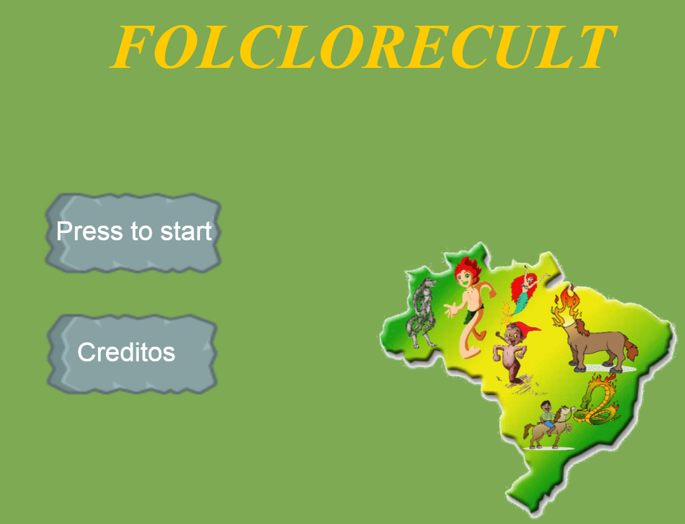
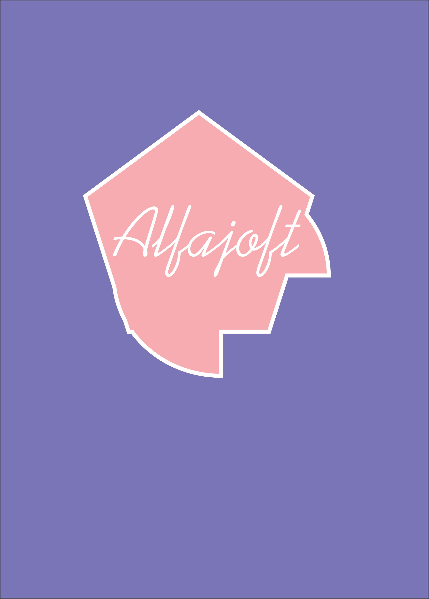

# Quem sou eu?
 Sou Elicia Porpino, estudande do Curso de Programação de Jogos Digitas- Ensino Médio-Tecnico!

 
 
# Portifolis

## Games 

[jOGO 1 Oficina :] - Primeiro jogo feito na oficina de Criação de Jogos, com a tematica sobre cultura
Nome do jogo :

[Jogo 1: Folclorecult] (https://eliciaa.github.io/Folclorecult/)

[]

[JOGO 2 Oficina :] - Segundo jogo feito na Oficina de Jogos, com a tematica mensagem. Nome do jogo : Quem Tem Boca Vai a Roma (https://thaynaNmedeiros.github.io/QTBVAR2/)

[] (https://eliciaa.github.io/Pergame/)

## Artes

## Apresentações
* Aula de música 
* Aula de teatro
* Aula de Jogos
1. Marcelo 
2. Tiago
3. Durval
 
* * *

** negrito

_ italico

~~ riscando

  dois espaços p/ pular linha
 3 * adiciona uma linha horizontal
 #s uma ou mais hastags criam capítulos ou sub 
 
 *s asteriscos adiciona uma lista não numerada 
 
 1s numeros adicionsm ums lista numerada 
 
 
 * * *
