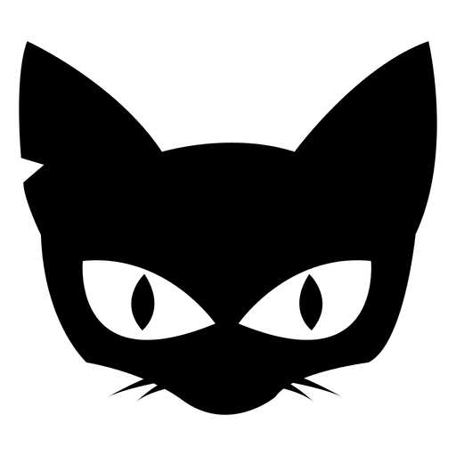

criando **minha**, _pagina_,  ~~principal~~.
 
 
[
 
# Quem sou eu 

Sou estudante do curso Programação de Jogos Digitais - 3M!

# Portifolis

## Games 

[jOGO 1 Oficina :] (https://eliciaa.github.io/Folclorecult/) 

[JOGO 2 Oficina :] (https://thaynaNmedeiros.github.io/QTBVAR2/)

[] (https://eliciaa.github.io/Pergame/)

## Artes

## Apresentações
* Aula de música 
* Aula de teatro
* Aula de Jogos
1. Marcelo 
2. Tiago
3. Durval
 
* * *

** negrito

_ italico

~~ riscando

  dois espaços p/ pular linha
 3 * adiciona uma linha horizontal
 #s uma ou mais hastags criam capítulos ou sub 
 
 *s asteriscos adiciona uma lista não numerada 
 
 1s numeros adicionsm ums lista numerada 
 
 
 * * *
