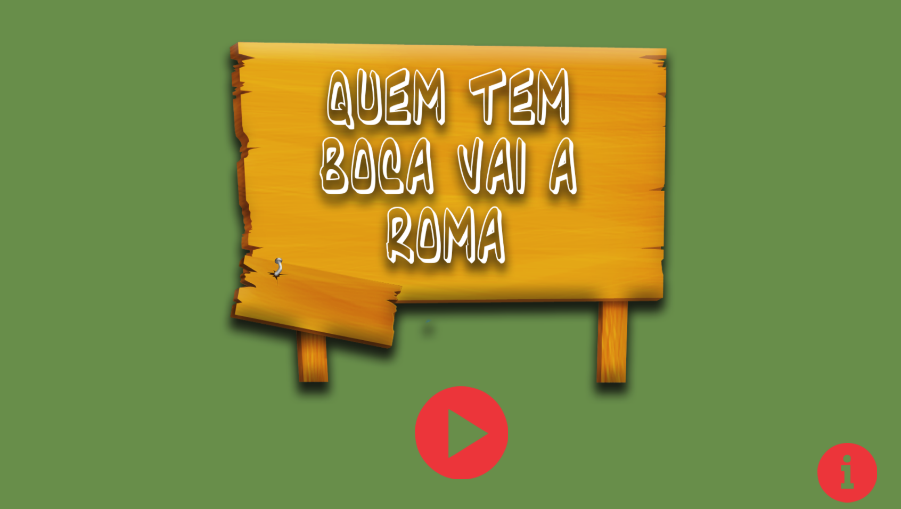

# Quem sou eu?
  
  
 Elícia Porpino da Silva, 18.
 Técnica em Programção de Jogos Digitais(IFRN-Ceará-Mirim/RN).
 
  Contatos:
  
  Email: eliciaporpino@gmail.com
   
   Facebook: [Elicia Porpino](https://www.facebook.com/)
   
   Instagram: [elicia_porpino](https://www.instagram.com/)
 
# Portfolio

## Games 

[jOGO 1 Oficina :] - Primeiro jogo feito na oficina de Criação de Jogos, com a tematica sobre cultura
Nome do jogo : [Folclorecult](https://eliciaa.github.io/Folclorecult/)

[JOGO 2 Oficina :] - Segundo jogo feito na Oficina de Jogos, com a tematica mensagem. Nome do jogo : [Quem tem boca vai a roma](https://thaynaNmedeiros.github.io/QTBVAR2/)

[JOGO 3 Oficina :] - Terceiro jogo feito na Oficina de Jogos, com a tematica livre . Nome do jogo
[Pergame](https://eliciaa.github.io/Pergame/)

# Projeto Integrador
  O projeto realizado tem como propósito um jogo que retrata a defesa do organismo humano a respeito das bactérias e vírus. A relevância do tema se dá a partir do fato de que o conhecimento do sistema imunológico permite ao indivíduo saber como funciona a defesa do corpo humano contra corpos estranhos e agentes patológicos. O funcionamento do sistema imune consiste na resposta coletiva e coordenada das células e moléculas diante dos agentes estranhos, isto caracteriza a resposta imune.
[Imuno Defense](https://eliciaa.github.io/imuno/)

 

# Artes

Artes em pixel!1

Gatinha!

 

Influence Map - Arte feita na disciplina de Motores!

# Animação
   
gii.gif)

# Empresas que já atuei

Alfajft.

Preguiça Studio.

Élice.

## Apresentações
 
 Projeto relacionado a Ética Ambiental, que foi proposto pelo professor Jorge Lima. O projeto foi elaborado pela turma Jogos Digitais, 2015.1. Esse slide está relacionado as artes do projeto. 
 

* * *

** negrito

_ italico

~~ riscando

  dois espaços p/ pular linha
 3 * adiciona uma linha horizontal
 #s uma ou mais hastags criam capítulos ou sub 
 
 *s asteriscos adiciona uma lista não numerada 
 
 1s numeros adicionsm ums lista numerada 
 
 
 * * *
